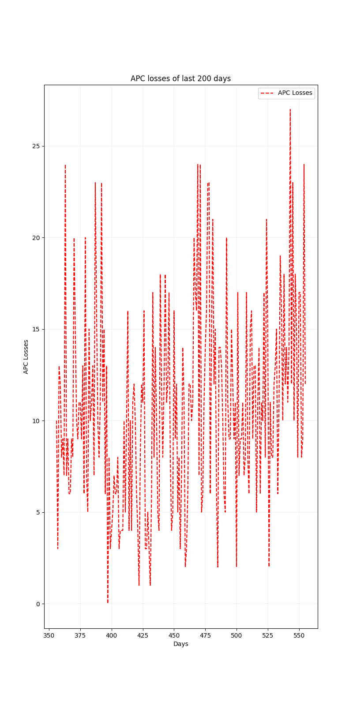

# Laboratory Work 1: Data Exploration and Visualization with Python

## Objective

To gain basic skills in using Python for data exploration and visualization.

## Assignment Overview

1. Installation of Jupyter Notebook through pip or Anaconda Distribution.
2. Download the dataset from [Kaggle](https://www.kaggle.com/datasets/piterfm/2022-ukraine-russian-war).
3. Variant selection based on the formula `N = ord("LLL") % 3 + 1`, where `N` is the variant number and `LLL` is the first letter of your name. The screenshot demonstrating the variant selection is included in the repository.
4. Utilization of Python's capabilities to explore and visualize the dataset following the prescribed tips and requirements.

## Tasks

- Read data from a CSV file and extract specified columns using numpy.
- Calculate daily APC losses.
- Identify the 5 days with the greatest APC losses.
- Calculate the number of APCs destroyed in the summer of 2023.
- Calculate the mean number of APCs destroyed between the 100th and 500th days of the war.
- Plot the APC losses for the last 200 days.

## Variant 3: Armored Personnel Carrier (APC) Losses Exploration

1. Develop a function to read a specified column from a CSV file and return it as a numpy array.
2. Extract data for the "APC" column using the function created in task 1.
3. Analyze the daily losses of APCs.
4. Find the days with the highest APC losses.
5. Find the total number of APCs destroyed in the summer of 2023.
6. Calculate the mean value of APCs destroyed between day 100 and day 500 of the war.
7. Create a visualization showcasing the APC losses for the last 200 days in the dataset.

## Report

The report details each step of the laboratory work, including the development and application of Python functions to analyze the dataset. The report is available as both a Jupyter Notebook (.ipynb) and a PDF file (.pdf).

- [View the Jupyter Notebook](report.ipynb)
- [View the PDF Report](report.pdf)

## Screenshots

## Conclusion

This laboratory work allowed for the development of fundamental skills in data analysis and visualization using Python.
